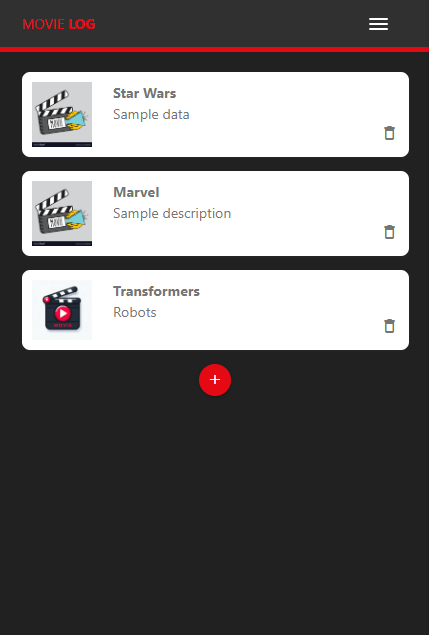
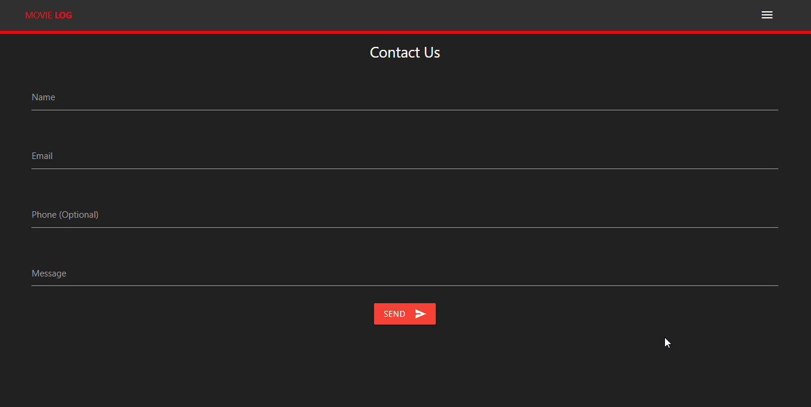

# INF654-Assignment 4 - Prototype Web Application: Movie Log

This project is a follow-up to a previous prototype project where we'll be expanding it by integrating it with firebase. By integrating the firebase database we can store and handle data, we can also perform CRUD operations and user authentication. CRUD operates are Create, Read, Update, and Delete. The web app is designed to catalog and manage a collection of movies like a watch list.

## Features

- Responsive design that adapts to different screen sizes for optimal user experience
- Interactive navigation menu for seamless user flow between different sections of the application.
- CRUD operations (Create, Read, Update, Delete)
- Firebase database - storing and handling data
- User authentication allowing users to login and register
- Ability to add new movie entries to the log with a user-friendly interface.
- ...

## Built With

- HTML, CSS, and JavaScript
- [Materialize CSS](https://materializecss.com/) - framework
- [Firebase](https://firebase.google.com/) - backend and database

## Setup and How to View the Prototype

1. ...
2. ...

## Gallery

Movie Log home page

Mobile view and side-form

    
    

Contact page

Incomplete
